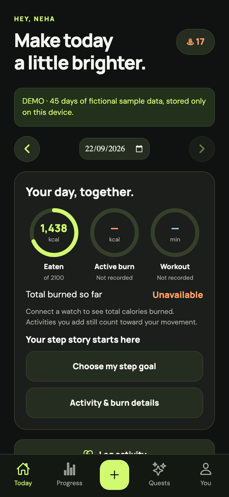
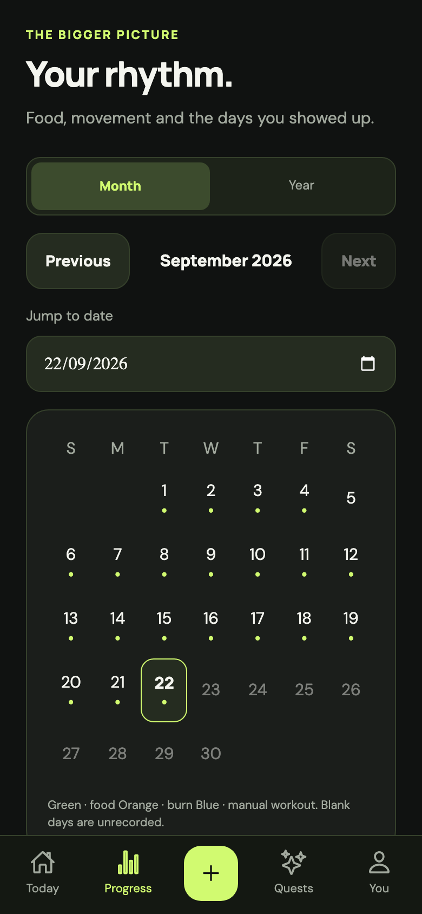

<div align="center">
  

# Fitkin

**A little more aware. A little more active. One day at a time.**

An open-source app for food, movement and everyday habits.

[](https://github.com/neha-pd/caloriesTracker/actions/workflows/ci.yml)
[](LICENSE)
[](https://github.com/neha-pd/caloriesTracker/releases/latest)

[Try the web demo](https://fitlens-kpph.onrender.com) · [Download Android APK](https://github.com/neha-pd/caloriesTracker/releases/latest) · [Share feedback](https://github.com/neha-pd/caloriesTracker/issues/new/choose) · [Contribute](CONTRIBUTING.md)

</div>

## Everyday progress, together

Log a meal, add a walk, notice your progress, and come back tomorrow. Fitkin brings food, movement and everyday habits into one place, with quests, streaks and a companion called Kin along the way.

This is an early community project, with room to improve. Try it, report a confusing screen, suggest a missing food, or contribute a fix.

**If Fitkin is useful or you’d like to follow its progress, a GitHub star is appreciated. Honest feedback is welcome too.**

## Take a look

<p align="center">
  
  &nbsp;
  
</p>

*Screenshots use fictional sample data in the web preview. Watch readings require a compatible phone and health connection.*

## Try it in a minute

1. Open the **[web app](https://fitlens-kpph.onrender.com)** or install the ARM64 APK from **[Releases](https://github.com/neha-pd/caloriesTracker/releases/latest)**.
2. Choose **Explore 45-day demo** on the welcome screen. No signup needed: it contains fictional meals, water logs and progress.
3. Search for a food, log an activity, explore the calendar, or create a share card.
4. [Tell us what felt useful — or confusing](https://github.com/neha-pd/caloriesTracker/issues/new/choose).

The Android APK is a direct download, not a Play Store listing. Install updates over the existing app to keep local data. Version 2.5.0 introduced required-update prompts for later releases; Android still asks you to approve installation. Real-account services use free hosting and may take a moment to wake up.

## What’s inside

| Everyday task | What Fitkin offers |
| --- | --- |
| **Track food** | Offline search across 13,681 food records, Indian-food aliases and recipe estimates, portions, custom foods and meal editing. |
| **Track movement** | Manual activities, weigh-ins, step goals, and food-versus-burn summaries. Missing watch readings stay missing rather than becoming invented numbers. |
| **See progress** | Day, month and year views, plus shareable PNG stories and coach reports. |
| **Share your wins** | Export day, month or year cards for Instagram Stories and WhatsApp Status. Save an image or use your phone’s share sheet; nothing posts automatically. |
| **Check in with your coach** | Share a full daily PNG report with meals, portions, macros, workouts, available burn readings, calorie target, current weight and target weight. |
| **Build a routine** | Water logs, quests, XP, streaks and achievements that reward participation. |
| **Connect a watch** | Android Health Connect and Apple Health adapters for supported readings. Watch data reaches Fitkin through the phone’s health service. |
| **Get a nudge** | Custom reminders and Android smart nudges for meals, water, movement, step milestones and newly synced workouts. |
| **Talk to Kin** | Optional online chat, optional diary context and reminder drafts you review before scheduling. No local-model downloads. |
| **Stay in control** | Account export and deletion, per-account offline queues, and Android home-screen widgets. |

### A few things to know

- **Food values are estimates.** The library includes 146 Indian recipe estimates; it is not a complete catalogue of every food. See [food sources and assumptions](docs/FOOD_CATALOG.md).
- **Chat is optional and online.** It uses free-only provider routes, with shared quotas and no paid fallback. Messages go to the provider when you use chat; diary sharing is optional. See [Kin setup and privacy](docs/FREE_CHAT.md).
- **Watch sync depends on your device.** Your companion app must share data with Health Connect or Apple Health. Android background checks can be delayed by the OS. Smart background nudges are Android-only; there is no standalone watch app. Physical-device testing is welcome.
- **The demo stays local.** Its fictional records do not connect to real health services or online chat.

## Project website

The [Fitkin project site](website/README.md) tells the story behind the app and explains how it is built. Its GitHub Pages workflow publishes changes from `main` once Pages is enabled by a repository administrator.

## Run it locally

Use **Node.js 22.22+ and npm**. The default local API uses embedded PostgreSQL: no Docker, cloud account or AI key is needed for the core tracker.

```sh
git clone https://github.com/neha-pd/caloriesTracker.git
cd caloriesTracker
npm ci
npm run dev:api:local
```

In a second terminal, start the browser app:

```sh
npm run web --workspace mobile
```

For native development:

```sh
cd mobile
npx expo prebuild
npx expo run:android
# On macOS with Xcode, for iOS:
# npx expo run:ios
```

Custom health and widget modules require a native build; **Expo Go is not supported** for those features. On a physical phone, set `EXPO_PUBLIC_API_URL` to your computer’s reachable LAN address. Production builds use HTTPS. Bring your own signing key for your own APK builds; the project’s team key is private.

Local API data lives in `backend/.data/local`. The local command intentionally ignores the root `.env`. For cloud services, use the [deployment guide](docs/DEPLOYMENT.md); for optional chat, use the [Kin guide](docs/FREE_CHAT.md). Never commit service credentials or signing keys.

## Project map

```text
mobile/       Expo + React Native app, screens and native modules
backend/      Fastify + TypeScript API and PostgreSQL storage
data/         Food recipe specifications and source material
checks/       Browser and native smoke checks
scripts/      Build, import and deployment helpers
docs/         Release notes, setup guides and design prototype
```

## Check your changes

```sh
npm run typecheck
npm test
npm run export:web --workspace mobile
```

Browser checks use Playwright. With the local API on port 3000 and the exported app served on port 8084:

```sh
python3 -m pip install -r checks/requirements.txt
python3 -m playwright install chromium
python3 checks/serve_spa.py
# In another terminal:
python3 checks/e2e.py
```

Run browser tests against your local services, not production: some create test accounts. The [CI workflow](.github/workflows/ci.yml) shows the complete suite. Android background delivery and watch interoperability also need physical-device checks.

## Help shape the next version

We’d especially appreciate:

- **First-use feedback:** where did you hesitate or wonder what to tap?
- **Indian food coverage:** missing names, regional aliases and sourced corrections.
- **Device testing:** watch sync, denied permissions, reminders and accessibility.
- **Contributions:** clearer copy, bug fixes, tests, translations and thoughtful UI improvements.

[Read the contribution guide](CONTRIBUTING.md), [report a bug](https://github.com/neha-pd/caloriesTracker/issues/new?template=bug_report.yml), or [share an idea](https://github.com/neha-pd/caloriesTracker/issues/new?template=feedback.yml). Please keep health information and credentials out of public reports.

## Release notes and credits

- [2.6.0 — Fitkin and Kin](docs/RELEASE_2.6.0.md)
- [Latest Android release](https://github.com/neha-pd/caloriesTracker/releases/latest)
- [2.5.0 — simpler activity and required updates](docs/RELEASE_2.5.0.md)
- [2.4.0 — personal step goals and smart nudges](docs/RELEASE_2.4.0.md)
- [2.3.0 — food, fitness and calendar views](docs/RELEASE_2.3.0.md)
- [Food sources and rebuild instructions](docs/FOOD_CATALOG.md)

Thanks to everyone who tries a build, reports an issue or contributes an improvement.

## License

Fitkin’s original code is available under the [MIT License](LICENSE). Dependencies and third-party data retain their own licenses and notices; see the [food-source documentation](docs/FOOD_CATALOG.md) for the bundled catalogue.
